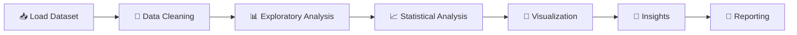

<!-- ========================================================= -->
<!--                   PREMIUM HEADER SECTION                  -->
<!-- ========================================================= -->

<h1>
  
</h1>

---

# 🌈 Tips-Data

### ✨ A Complete Exploratory Data Analysis & Visualization Showcase

> 🎯 This project presents a comprehensive **Exploratory Data Analysis (EDA)** and **Visualization Suite** built on the famous **Tips Dataset from Seaborn**.
>
> It demonstrates **100+ analytical techniques**, **statistical explorations**, and **advanced visualizations** using Python's modern Data Science ecosystem.

---

# 📚 Table of Contents

<table align="center">
<tr>
<td width="50%">

### 🚀 Overview
- 🎯 Project Introduction
- 📈 Analysis Scope
- ✨ Highlights

### 🛠 Technology Stack
- 🐍 Core Libraries
- 📊 Visualization Tools
- ⚡ Statistical Libraries

</td>

<td width="50%">

### 🎨 Features
- 📈 Statistical Analysis
- 📉 Visual Analytics
- 🧠 Data Exploration
- 🚀 Performance Tools

### 💎 Ecosystem
- 🔬 Research Tools
- 💾 Storage Formats
- 🌐 Platform Support

</td>
</tr>
</table>

---

# 🎯 Project Highlights

<table>
<tr>
<td width="33%" align="center">

## 📊 100+
Visualizations

Advanced plotting techniques using multiple visualization libraries.

</td>

<td width="33%" align="center">

## 🧠 Deep EDA

Comprehensive exploratory analysis and statistical investigation.

</td>

<td width="33%" align="center">

## 🚀 Modern Stack

Industry-standard Python Data Science ecosystem.

</td>
</tr>
</table>

---

# ⚡ Data Science Libraries & Technology Stack

## 🐍 Core Python Ecosystem

---

## 📊 Visualization Libraries

---

## 📈 Statistical & Machine Learning

---

## 💻 Development Environment

---

## 💾 Data Formats

---

## 🌐 Platform Support

---

## 📦 Package Management

---

## 📝 Documentation

---

# 🎨 Analytical Capabilities

---

# 🚀 Data Processing Workflow

---

# 💎 Project Features

| Feature | Description |
|----------|-------------|
| 📥 Data Loading | Efficient dataset ingestion |
| 🧹 Data Cleaning | Missing value handling & preprocessing |
| 📊 Data Analysis | Comprehensive EDA techniques |
| 📈 Statistical Testing | Hypothesis testing & statistical insights |
| 🎨 Data Visualization | Static & advanced plots |
| ⚡ Fast Computation | Optimized numerical processing |
| 💾 Memory Efficient | Efficient resource utilization |
| 🔄 Parallel Processing | Enhanced computation performance |
| 📑 Reporting | Structured analytical reporting |
| 📉 Dashboard Creation | Visualization dashboard concepts |
| 🌐 Interactive Plots | Interactive exploration |
| 🔬 Research Ready | Suitable for academic & professional studies |

---

## 🌟 Project Metrics

---

### 💜 Crafted with Python • Data Science • Analytics • Visualization

